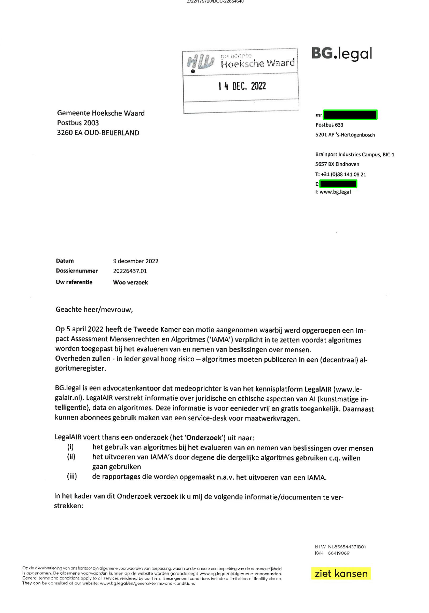

# TPDLTextRedaction

This repository contains the data and notebooks for the Short paper submission 'Detection of Redacted Text in Legal Documents' to the 
2023 Edition of the TPDL conference.


## Installation

To be able to run the code and experiments in this repository, follow these steps:

1. Install Anaconda: 

   - Visit the [Anaconda website](https://www.anaconda.com/products/individual) and download the installer for your operating system.
   - Follow the installation instructions provided for your specific OS.

2. Clone this repository:
```
git clone https://github.com/RubenvanHeusden/TPDLTextRedaction.git
```
3. Navigate to the project directory:
```
cd TPDLTextRedaction
```
4. Create a new Anaconda environment:

   Open a terminal (or Anaconda Prompt on Windows) and run the following command, which installs the requirements according to the environment file we provide:
   ```
   conda env create -f environment.yml
   ```
   
5. Activate the environment:
  ```
  conda activate text_redaction_env
  ```
6. Alternative using pip
   If you prefer using pip, you can also install the environment using the requirements file we supplied
   ```
   pip install -r requirements.txt
   ```
7. Running Jupyter Notebook:
   If you haven't worked with Jupyter Notebook yet, you should set up jupyter so that you can select the right kernel and work with the packages we just installed.
   ```
   ipython kernel install --name "text_redaction_env" --user
   ```
   
8. Additional Requirements
   If you want to run the demo and convert PDF files yourself, you should first install `poppler` on your system.

9. Running the Demo
   To run the demo locally you need Poppler, and then you can run the command below from the `scripts` folder:
   `python run_redaction_detector.py --pdf_path ../examples/Woo-verzoek_Geredigeerd.pdf --output_path demo_output.pdf`
   Which will run the demo on the pdf in the `examples` directory and put an annotated version like the one on the live demo in the root folder of the directory. 

## Directory Structure

- `notebooks/`: Contains Jupyter Notebook files.
    - `Experiments.ipynb`: Notebook containing the main experiments and explanation of the algorithm. 
- `datasets/`: Contains source code files.
    - `data.csv`: Contains the data with the labels of the different pages
    - `images`: contains the PNG images of the pages.
    - `gold_standard.json`: Contains the json file of the manual annotations from the research.
- `scripts`: Directory containing scripts to run the detection algorithm automatically on a variety of inputs, with automatic PNG conversion, as well as a file containing the algorithm as a class for convenience
- `examples`: contains an example pdf for the demo
